# TiMi - Trade in Minutes 这应该只是其他人复现的部分而已，作者github简历和论文作者简历不符

## A Rationality-Driven Multi-Agent System for Quantitative Financial Trading

TiMi is a production-ready algorithmic trading system that leverages Large Language Models (LLMs) and specialized AI agents to develop, optimize, and execute quantitative trading strategies with minute-level precision. Built on cutting-edge research, TiMi implements a three-stage architecture that separates complex reasoning from time-sensitive execution, achieving both comprehensive strategy development and quantitative-level efficiency.

---

## Table of Contents

- [Overview](#overview)
- [Key Features](#key-features)
- [Architecture](#architecture)
- [Installation](#installation)
- [Quick Start](#quick-start)
- [Configuration](#configuration)
- [Usage](#usage)
- [System Components](#system-components)
- [Risk Management Implementation](#risk-management-implementation)
- [Development](#development)
- [Testing](#testing)
- [Performance](#performance)
- [Contributing](#contributing)
- [License](#license)
- [Citation](#citation)
- [Disclaimer](#disclaimer)

---

## Overview

TiMi (Trade in Minutes) implements the system described in the research paper "Trade in Minutes! Rationality-Driven Agentic System for Quantitative Financial Trading" (arXiv:2510.04787). Unlike traditional trading systems that rely on human emotions or simple rule-based approaches, TiMi achieves **mechanical rationality** through specialized AI agents that handle semantic analysis, code programming, and mathematical reasoning.

### Why TiMi?

**Traditional Challenges:**

- Anthropomorphic trading agents introduce emotional biases
- Reliance on peripheral information creates temporal lags
- Continuous inference during deployment causes latency
- Difficulty adapting to volatile market dynamics

**TiMi's Solution:**

- Rationality-driven decision making without emotional bias
- Focus on objective technical indicators with dynamic windows
- Decoupled analysis and execution for low-latency trading
- Hierarchical optimization for robust strategy refinement

---

## Key Features

### Multi-Agent System

- **4 Specialized Agents** with distinct LLM capabilities
- **Macro Analysis Agent (Ama)**: Identifies market patterns using semantic analysis
- **Strategy Adaptation Agent (Asa)**: Customizes strategies per trading pair
- **Bot Evolution Agent (Abe)**: Generates executable Python trading bots
- **Feedback Reflection Agent (Afr)**: Optimizes parameters mathematically

### Trading Capabilities

- **Minute-Level Execution**: High-frequency trading with low latency
- **Grid Trading Strategy**: Implements Algorithm 1 from the paper
- **Dynamic Parameters**: Volatility-based order placement and sizing
- **Multi-Pair Support**: Trade 200+ pairs simultaneously
- **Paper Trading Mode**: Safe testing without real capital

### Risk Configuration

- **Drawdown Protection**: Automatic emergency stop at configurable thresholds
- **Position Limits**: Size and count restrictions
- **Stop Loss**: Per-position risk controls
- **Price Deviation Checks**: Prevent execution at abnormal prices
- **Real-Time Monitoring**: Comprehensive risk reporting

### Infrastructure

- **Multi-Provider LLM**: OpenAI, Anthropic support
- **Exchange Integration**: Binance with testnet support
- **Technical Indicators**: 20+ indicators including SMA, EMA, RSI, MACD
- **Structured Logging**: JSON logs with trade/position tracking
- **Configuration-Driven**: YAML-based with environment overrides

---

## Architecture

TiMi implements a three-stage architecture that decouples strategy development from real-time execution:

### Stage I: Policy (Offline)

Complex reasoning and strategy development occur offline, leveraging specialized LLM capabilities:

```text
Market Data → Macro Analysis → General Strategies → Strategy Adaptation →
Pair-Specific Strategies → Bot Evolution → Trading Bot Code
```

### Stage II: Optimization (Offline)

Prototype bots undergo simulation to gather feedback and iteratively optimize:

```text
Trading Bot → Simulation → Feedback Collection → Mathematical Reflection →
Constraint Formulation → Parameter Optimization → Hierarchical Refinement
```

### Stage III: Deployment (Live)

Thoroughly optimized bots execute with minimal latency:

```text
Optimized Bot → Market Monitor → Order Placement → Position Management →
Risk Checks → Profit Taking → Statistics Reporting
```

**Efficiency Gain**: η = cagent/cbot, where cbot ≪ cagent, providing significant performance improvement as trading frequency increases.

### System Flow Diagram

```mermaid
graph TB
    subgraph OFFLINE["OFFLINE ENVIRONMENT"]
        subgraph POLICY["STAGE I: POLICY - Strategy Development"]
            A[Macro Analysis Agent<br/>Ama] -->|Market Patterns &<br/>General Strategies| B[Strategy Adaptation Agent<br/>Asa]
            B -->|Pair-Specific<br/>Customization| C[Bot Evolution Agent<br/>Abe]
            C -->|Trading Bot Code<br/>Python| D[Prototype Bot]
        end

        subgraph OPT["STAGE II: OPTIMIZATION - Parameter Refinement"]
            D -->|Simulate| E[Simulation Environment]
            E -->|Performance Metrics &<br/>Risk Events| F[Feedback Reflection Agent<br/>Afr]
            F -->|Optimized Parameters<br/>& Constraints| G[Hierarchical Refinement]
            G -->|Parameter → Function<br/>→ Strategy| H[Advanced Bot]
        end
    end

    H -->|Deploy| LIVE

    subgraph LIVE["LIVE ENVIRONMENT"]
        subgraph DEPLOY["STAGE III: DEPLOYMENT - Minute-Level Trading"]
            I[Market Monitor] -->|Real-time Data| J[Order Placement]
            J -->|Limit Orders| K[Position Manager]
            K -->|Risk Check| L[Risk Manager]
            L -->|Approved| M[Profit Taking]
            M -->|Trade Execution| N[Performance Stats]
        end
    end

    style OFFLINE fill:#d4e8ff,stroke:#0047ab,stroke-width:4px,color:#000
    style LIVE fill:#ffe4b3,stroke:#d97706,stroke-width:4px,color:#000
    style POLICY fill:#e3f2ff,stroke:#1e40af,stroke-width:3px,color:#000
    style OPT fill:#e3f2ff,stroke:#1e40af,stroke-width:3px,color:#000
    style DEPLOY fill:#ffedd5,stroke:#ea580c,stroke-width:3px,color:#000
    style A fill:#bfdbfe,stroke:#1e40af,stroke-width:2px,color:#000
    style B fill:#bfdbfe,stroke:#1e40af,stroke-width:2px,color:#000
    style C fill:#bfdbfe,stroke:#1e40af,stroke-width:2px,color:#000
    style F fill:#bfdbfe,stroke:#1e40af,stroke-width:2px,color:#000
    style I fill:#fed7aa,stroke:#ea580c,stroke-width:2px,color:#000
    style J fill:#fed7aa,stroke:#ea580c,stroke-width:2px,color:#000
    style K fill:#fed7aa,stroke:#ea580c,stroke-width:2px,color:#000
    style L fill:#fed7aa,stroke:#ea580c,stroke-width:2px,color:#000
```



---

## Installation

### Prerequisites

- Python 3.9 or higher
- pip package manager
- API keys for LLM provider (OpenAI or Anthropic)
- Exchange API credentials (Binance or compatible)

### Step 1: Clone Repository

```bash
git clone https://github.com/ReverseZoom2151/TiMi.git
cd TiMi
```

### Step 2: Create Virtual Environment

```bash
# Create virtual environment
python -m venv venv

# Activate virtual environment
# On Windows:
venv\Scripts\activate
# On Linux/Mac:
source venv/bin/activate
```

### Step 3: Install Dependencies

```bash
pip install -r requirements.txt
```

### Step 4: Configure Environment

```bash
# Copy environment template
cp .env.example .env

# Edit .env with your API keys
# Required:
# - OPENAI_API_KEY or ANTHROPIC_API_KEY
# - BINANCE_API_KEY
# - BINANCE_API_SECRET
```

### Step 5: Verify Installation

```bash
python tests/test_system.py
```

Expected output:

```text
=== Testing Configuration ===
[OK] Config loaded
=== Testing LLM Client ===
[OK] LLM client initialized
=== Testing Exchange Connector ===
[OK] Exchange connector created
=== Testing Agents ===
[OK] Agent classes loaded
[OK] All systems operational!
```

---

## Quick Start

### 1. Paper Trading (Recommended)

Start paper trading on BTC/USDT for 1 hour:

```bash
python run_timi.py --mode paper --pairs BTC/USDT --duration 1
```

Multiple pairs:

```bash
python run_timi.py --mode paper --pairs BTC/USDT ETH/USDT SOL/USDT --duration 24
```

### 2. Monitor Performance

Watch real-time logs:

```bash
# In another terminal
tail -f logs/timi.log
```

### 3. Review Statistics

The system logs statistics every hour:

```json
{
  "bot_stats": {
    "BTC/USDT": {
      "trades_executed": 15,
      "total_pnl": 125.50,
      "win_rate": 0.67
    }
  },
  "positions": {
    "open_positions": 2,
    "total_pnl": 45.30,
    "win_rate": 0.65
  },
  "risk": {
    "current_drawdown": 0.02,
    "emergency_stop": false
  }
}
```

---

## Configuration

TiMi uses `config.yaml` for system configuration. Key sections:

### LLM Configuration

```yaml
llm:
  semantic:
    provider: openai  # openai, anthropic
    model: gpt-5-2025-08-07
    temperature: 0.7
    max_tokens: 4000

  code:
    provider: openai
    model: gpt-5-pro-2025-10-06
    temperature: 0.3
    max_tokens: 8000

  reasoning:
    provider: openai
    model: gpt-5-pro-2025-10-06
    temperature: 0.2
    max_tokens: 4000
```

**Alternative Claude Configuration:**

```yaml
llm:
  semantic:
    provider: anthropic
    model: claude-sonnet-4-5-20250514  # Smartest for complex tasks

  code:
    provider: anthropic
    model: claude-sonnet-4-5-20250514  # Best for coding

  reasoning:
    provider: anthropic
    model: claude-opus-4-1-20250514    # Specialized reasoning
```

### Trading Parameters

```yaml
strategy:
  execution_interval: 1  # Minutes between execution cycles
  lookback_period: 60    # Minutes for volatility calculation
  min_volume: 1000000    # Minimum 24h volume (USD)
  min_volatility: 0.005  # Minimum volatility (0.5%)
  capital_per_pair: 100  # Capital allocation per pair (USD)

  # Price distribution for grid levels (exponents)
  price_distribution: [0.5, 0.75, 1.0, 1.25, 1.5, 2.0, 2.5]

  # Quantity distribution (proportions)
  quantity_distribution: [0.2, 0.2, 0.2, 0.15, 0.15, 0.05, 0.05]

  # Profit/loss thresholds (multiples of volatility)
  profit_loss_thresholds: [1.5, 2.0, 3.0, 5.0]
```

### Risk Management

```yaml
risk:
  max_drawdown: 20          # Maximum drawdown percentage
  max_position_pct: 10      # Maximum position as % of capital
  max_concurrent_positions: 5
  stop_loss_pct: 5          # Stop loss percentage
  max_price_deviation: 2    # Maximum price deviation percentage
```

---

## Usage

### Command Line Interface

```bash
python run_timi.py [OPTIONS]
```

**Options:**

- `--mode` : Trading mode (paper, live, backtest)
- `--pairs` : Space-separated list of trading pairs
- `--duration` : Duration in hours for paper/live trading
- `--config` : Path to config file (default: config.yaml)

**Examples:**

```bash
# Paper trade BTC for 24 hours
python run_timi.py --mode paper --pairs BTC/USDT --duration 24

# Paper trade multiple pairs for 1 hour
python run_timi.py --mode paper --pairs BTC/USDT ETH/USDT BNB/USDT --duration 1

# Use custom config
python run_timi.py --mode paper --config my_config.yaml --pairs BTC/USDT
```

### Programmatic Usage

```python
import asyncio
from timi.utils.config import Config
from timi.main import TiMiSystem

async def main():
    # Initialize system
    config = Config()
    system = TiMiSystem(config)

    await system.initialize()

    # Run policy stage to generate strategies
    pairs = ['BTC/USDT', 'ETH/USDT']
    pair_configs = await system.run_policy_stage(pairs)

    # Deploy trading bots
    await system.deploy_bots(pair_configs)

    # Cleanup
    await system.shutdown()

asyncio.run(main())
```

### Using Individual Agents

```python
import asyncio
from timi.llm.client import LLMClient
from timi.exchange.factory import ExchangeFactory
from timi.data import MarketDataManager
from timi.agents import MacroAnalysisAgent

async def analyze_market():
    # Setup components
    llm_client = LLMClient()
    exchange = ExchangeFactory.create_default_exchange()
    market_data = MarketDataManager(exchange)

    # Create macro analysis agent
    agent = MacroAnalysisAgent(llm_client, market_data)

    # Execute analysis
    result = await agent.execute(
        pairs=['BTC/USDT', 'ETH/USDT'],
        time_window=7
    )

    print(f"Strategies: {result.data}")

    await exchange.close()

asyncio.run(analyze_market())
```

---

## System Components

### Multi-Agent System Details

#### Macro Analysis Agent (Ama)

- **File**: `timi/agents/macro_analysis.py`
- **Capability**: Semantic Analysis (φ)
- **Function**: Identifies market patterns and generates general strategies
- **Input**: Market data, technical indicators, time windows
- **Output**: General trading strategies

#### Strategy Adaptation Agent (Asa)

- **File**: `timi/agents/strategy_adaptation.py`
- **Capabilities**: Semantic Analysis (φ) + Mathematical Reasoning (γ)
- **Function**: Customizes strategies for specific trading pairs
- **Input**: General strategies, pair characteristics
- **Output**: Pair-specific strategies with initialized parameters

#### Bot Evolution Agent (Abe)

- **File**: `timi/agents/bot_evolution.py`
- **Capability**: Code Programming (ψ)
- **Function**: Transforms strategies into executable Python code
- **Input**: Strategy specifications, parameters
- **Output**: Trading bot code following programming laws

#### Feedback Reflection Agent (Afr)

- **File**: `timi/agents/feedback_reflection.py`
- **Capability**: Mathematical Reasoning (γ)
- **Function**: Optimizes parameters through mathematical reflection
- **Input**: Trading feedback, performance metrics
- **Output**: Optimized parameters, refinement guidance

### Trading Engine

#### Bot Engine

- **File**: `timi/core/bot_engine.py`
- **Function**: Implements Algorithm 1 from paper
- **Features**:
  - Minute-level execution cycles
  - Volatility calculation (Φ)
  - Grid order placement
  - Position monitoring
  - Profit-taking logic

#### Position Manager

- **File**: `timi/core/position_manager.py`
- **Function**: Tracks positions and calculates P&L
- **Features**:
  - Entry/exit tracking
  - Realized & unrealized P&L
  - Win rate statistics
  - Position aggregation

#### Order Manager

- **File**: `timi/core/order_manager.py`
- **Function**: Manages order lifecycle
- **Features**:
  - Active order tracking
  - Fill monitoring
  - Cancellation handling
  - Fill rate statistics

### Data Layer

#### Market Data Manager

- **File**: `timi/data/market_data.py`
- **Functions**:
  - OHLCV data retrieval with caching
  - Volatility calculation (Algorithm 1)
  - Pair qualification based on volume/volatility
  - Market statistics aggregation

#### Technical Indicators

- **File**: `timi/data/indicators.py`
- **Indicators**:
  - SMA, EMA (moving averages)
  - RSI (relative strength index)
  - MACD (trend indicator)
  - Bollinger Bands (volatility)
  - ATR (average true range)
  - Custom trend identification

### Exchange Layer

#### Binance Connector

- **File**: `timi/exchange/binance.py`
- **Features**:
  - Futures trading via CCXT
  - Testnet support (default)
  - Order management
  - Position tracking
  - Market data retrieval

---

## Risk Management Implementation

TiMi implements comprehensive risk management:

### Drawdown Protection

- Monitors current capital against peak capital
- Triggers emergency stop at configurable threshold (default: 20%)
- Warning alerts at 75% of limit

### Position Limits

- Maximum concurrent positions (default: 5)
- Maximum position size as % of capital (default: 10%)
- Per-pair capital allocation

### Stop Loss

- Per-position stop loss (default: 5%)
- Automatic position closure on breach
- Configurable per strategy

### Price Deviation

- Checks order price against market price
- Prevents execution during abnormal conditions
- Configurable deviation threshold (default: 2%)

### Emergency Controls

- Manual emergency stop flag
- Automatic halt on critical violations
- Graceful shutdown procedures

### Risk Reporting

```python
risk_report = risk_manager.get_risk_report()
# Returns:
{
    'initial_capital': 10000,
    'current_capital': 10500,
    'peak_capital': 11000,
    'current_drawdown': 0.045,
    'max_drawdown_limit': 0.20,
    'open_positions': 3,
    'emergency_stop': False,
    'violations_count': 0
}
```

---

## Development

### Project Structure

```text
TiMi/
├── timi/                      # Main package
│   ├── agents/                # Multi-agent system
│   │   ├── base.py           # Base agent class
│   │   ├── macro_analysis.py
│   │   ├── strategy_adaptation.py
│   │   ├── bot_evolution.py
│   │   └── feedback_reflection.py
│   ├── core/                  # Trading engine
│   │   ├── bot_engine.py     # Algorithm 1 implementation
│   │   ├── position_manager.py
│   │   └── order_manager.py
│   ├── data/                  # Market data
│   │   ├── market_data.py
│   │   └── indicators.py
│   ├── exchange/              # Exchange connectors
│   │   ├── base.py
│   │   ├── binance.py
│   │   └── factory.py
│   ├── llm/                   # LLM integration
│   │   ├── base.py
│   │   └── client.py
│   ├── risk/                  # Risk management
│   │   ├── risk_manager.py
│   │   └── constraints.py
│   ├── utils/                 # Utilities
│   │   ├── config.py
│   │   └── logging.py
│   └── main.py                # Main entry point
├── tests/                     # Test suite
│   ├── test_system.py        # System verification test
│   ├── unit/
│   └── integration/
├── docs/                      # Documentation
│   └── timi_arxiv_2510.04787.pdf  # Original research paper
├── logs/                      # Log files (gitignored)
├── data/                      # Data storage (gitignored)
├── config.yaml                # Configuration
├── .env.example               # Environment template
├── requirements.txt           # Dependencies
├── run_timi.py               # Run script
└── README.md                 # This file
```

### Code Quality

- Type hints throughout
- Comprehensive docstrings
- PEP 8 style compliance
- Error handling with custom exceptions
- Structured logging

### Adding New Strategies

1. Extend strategy generation in `MacroAnalysisAgent`
2. Add customization logic in `StrategyAdaptationAgent`
3. Update bot code templates in `BotEvolutionAgent`
4. Test in paper trading mode

### Adding New Exchanges

1. Create new connector implementing `BaseExchange`
2. Add to `ExchangeFactory`
3. Update configuration schema
4. Test thoroughly on testnet

---

## Testing

### Run System Test

```bash
python tests/test_system.py
```

Tests:

- Configuration loading
- LLM client initialization
- Exchange connectivity
- Agent instantiation

### Unit Tests

```bash
pytest tests/unit/
```

### Integration Tests

```bash
pytest tests/integration/
```

### Paper Trading Test

Recommended before live trading:

```bash
# Run for 24-48 hours
python run_timi.py --mode paper --pairs BTC/USDT ETH/USDT --duration 48
```

Monitor:

- Win rate > 50%
- Positive total P&L
- Drawdown < 10%
- No emergency stops

---

## Performance

### Benchmarks

Tested on 200+ trading pairs across U.S. stock indices and cryptocurrency markets:

**Metrics** (from paper):

- Annual Rate of Return: 6.4% (stocks), 8.0% (mainstream crypto), 13.7% (altcoins)
- Sharpe Ratio: Competitive across all markets
- Maximum Drawdown: Well-controlled
- Action Latency: ~137ms average (180x faster than continuous-inference approaches)

**Efficiency**:

- Decoupled architecture eliminates continuous LLM inference
- Efficiency ratio: η = cagent/cbot ≈ 180x
- Minute-level execution frequency
- CPU-only runtime for deployment stage

### Optimization

- LLM response caching
- Market data caching (1-minute TTL)
- Async/await for concurrent operations
- Connection pooling for exchange API
- Batch processing where possible

---

## Contributing

We welcome contributions! Here's how to get started:

### Reporting Issues

- Use GitHub Issues
- Provide detailed description
- Include logs and configuration (redact sensitive data)
- Specify Python version and OS

### Pull Requests

1. Fork the repository
2. Create a feature branch
3. Make your changes
4. Add tests for new functionality
5. Ensure all tests pass
6. Update documentation
7. Submit pull request

### Code Standards

- Follow PEP 8
- Add type hints
- Write docstrings
- Include unit tests
- Update relevant documentation

### Areas for Contribution

- Additional exchange connectors
- More trading strategies
- Backtesting framework enhancements
- Web dashboard
- Performance optimizations
- Documentation improvements

---

## License

MIT License

Copyright (c) 2025 TiMi Development Team

Permission is hereby granted, free of charge, to any person obtaining a copy
of this software and associated documentation files (the "Software"), to deal
in the Software without restriction, including without limitation the rights
to use, copy, modify, merge, publish, distribute, sublicense, and/or sell
copies of the Software, and to permit persons to whom the Software is
furnished to do so, subject to the following conditions:

The above copyright notice and this permission notice shall be included in all
copies or substantial portions of the Software.

THE SOFTWARE IS PROVIDED "AS IS", WITHOUT WARRANTY OF ANY KIND, EXPRESS OR
IMPLIED, INCLUDING BUT NOT LIMITED TO THE WARRANTIES OF MERCHANTABILITY,
FITNESS FOR A PARTICULAR PURPOSE AND NONINFRINGEMENT. IN NO EVENT SHALL THE
AUTHORS OR COPYRIGHT HOLDERS BE LIABLE FOR ANY CLAIM, DAMAGES OR OTHER
LIABILITY, WHETHER IN AN ACTION OF CONTRACT, TORT OR OTHERWISE, ARISING FROM,
OUT OF OR IN CONNECTION WITH THE SOFTWARE OR THE USE OR OTHER DEALINGS IN THE
SOFTWARE.

---

## Citation

If you use this implementation in your research, please cite the original paper:

```bibtex
@article{song2025timi,
  title={Trade in Minutes! Rationality-Driven Agentic System for Quantitative Financial Trading},
  author={Song, Zifan and Song, Kaitao and Hu, Guosheng and Qi, Ding and Gao, Junyao and Wang, Xiaohua and Li, Dongsheng and Zhao, Cairong},
  journal={arXiv preprint arXiv:2510.04787},
  year={2025}
}
```

**Paper**: [arXiv:2510.04787](https://arxiv.org/abs/2510.04787)

---

## Disclaimer

### IMPORTANT: READ BEFORE USING

#### Financial Risk

Trading involves substantial risk of loss. This software is provided for **educational and research purposes only**. It is **NOT** financial advice.

### No Warranties

This software is provided "AS IS", WITHOUT WARRANTY OF ANY KIND, EXPRESS OR IMPLIED, including but not limited to the warranties of MERCHANTABILITY, FITNESS FOR A PARTICULAR PURPOSE, and NONINFRINGEMENT.

### Use at Your Own Risk

- Only trade with capital you can afford to lose completely
- Past performance does not guarantee future results
- Thoroughly test in paper trading mode before using real money
- Start with minimal capital if/when transitioning to live trading
- Monitor your trading continuously
- Ensure compliance with all applicable financial regulations

### Not Investment Advice

The authors, contributors, and distributors of this software:

- Are not registered investment advisors
- Do not provide financial advice
- Make no recommendations regarding any securities or trading strategies
- Are not responsible for your trading decisions or outcomes

### Regulatory Compliance

You are responsible for:

- Understanding and complying with all applicable laws and regulations
- Obtaining necessary licenses or registrations
- Paying applicable taxes on trading profits
- Following your jurisdiction's financial regulations

### Liability

In no event shall the authors, copyright holders, or contributors be liable for any claim, damages, or other liability arising from the use of this software.

---

## Acknowledgments

This implementation is based on research conducted at:

- Tongji University
- Microsoft Research Asia
- University of Bristol
- Fudan University

Special thanks to the original paper authors for their groundbreaking work in rationality-driven agentic trading systems.

---

## Support

- **Documentation**: See documentation links above
- **Issues**: GitHub Issues
- **Discussions**: GitHub Discussions

---

**Built with rationality. Trade with caution.**
